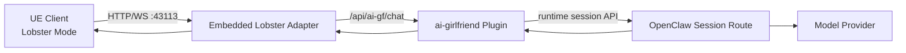
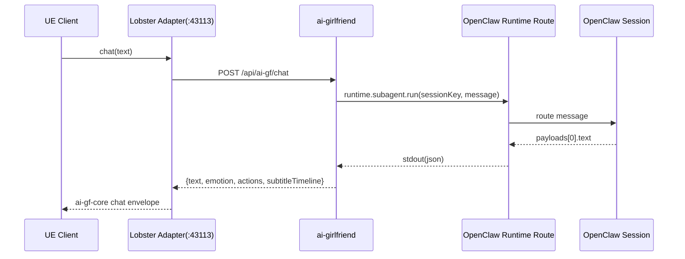
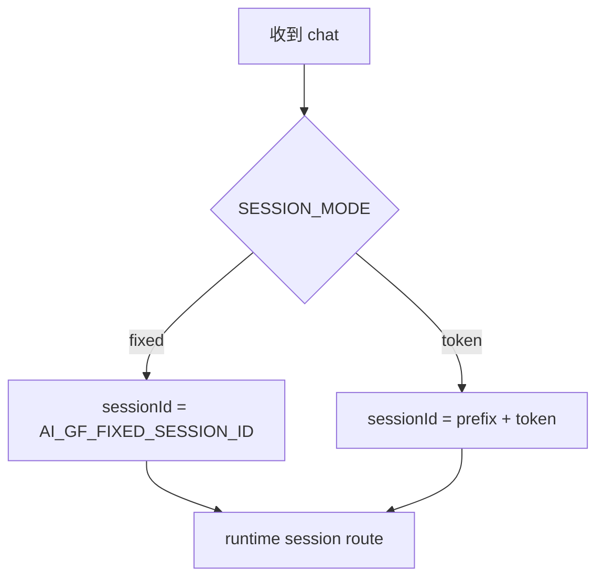

# AI-Girlfriend 详细设计

## 1. 总体架构



## 2. 模块拆分

### 2.1 `src/http.ts`
- 对外 HTTP 路由处理：health/login/info/chat
- 会话持久化读写（`AI_GF_SESSION_PATH`）
- 聊天回包结构化组装

### 2.2 `src/adapter-service.ts`
- 由插件生命周期托管内嵌 adapter 进程
- 启停：`startAdapterService/stopAdapterService`

### 2.3 `vendor/lobster-adapter`
- 承担 UE 协议兼容与 43113 端口服务
- 与 ai-gf 插件通过 HTTP 对接

## 3. 关键流程

### 3.1 聊天流程时序



### 3.2 会话 ID 决策



## 4. 配置设计

| 变量 | 默认值 | 说明 |
|---|---|---|
| `AI_GF_SESSION_MODE` | `fixed` | 会话模式（fixed/token） |
| `AI_GF_FIXED_SESSION_ID` | `ai-gf-fixed-session` | 固定会话 ID |
| `AI_GF_GATEWAY_SESSION_PREFIX` | `voice-bridge-session-ai-gf-` | token 模式前缀 |
| `AI_GF_AGENT_TIMEOUT_MS` | `30000` | runtime 路由超时 |
| `AI_GF_SYSTEM_PROMPT` | - | 系统提示词 |
| `AI_GF_SESSION_PATH` | `./state/ai-gf-sessions.json` | 会话持久化文件（建议按部署环境配置） |

## 5. 数据结构

### 5.1 入参（chat）
```json
{ "text": "你好" }
```

### 5.2 出参（chat）
```json
{
  "ok": true,
  "token": "ai-gf-main-token",
  "data": {
    "text": "我叫 Clawra",
    "emotion": "calm",
    "actions": [{ "name": "IDLE_STD_011_1_body", "startMs": 0, "durationMs": 1200, "intensity": 0.3 }],
    "subtitleTimeline": [{ "text": "我叫 Clawra", "startMs": 0, "endMs": 1320 }]
  }
}
```

## 6. 错误处理

1. Runtime 路由失败：返回 500 并带错误信息。
2. 会话缺失/非法 token：401。
3. adapter 未启动：UE 侧会出现 continue/new game 失败（需先恢复 43113）。

## 7. 可观测性与排障建议

- 先看 `43113/healthz`。
- 再看 `/api/ai-gf/health`（确认 sessionMode）。
- 若回复异常，检查：
  - 会话 ID 规则是否符合预期
  - 是否有旧 adapter 进程抢占
  - gateway 是否完成重启

## 8. 演进计划

1. 增加会话审计接口（按固定会话快速检索最近 N 条）。
2. 增加动作/情绪策略插件化（由规则或模型后处理）。
